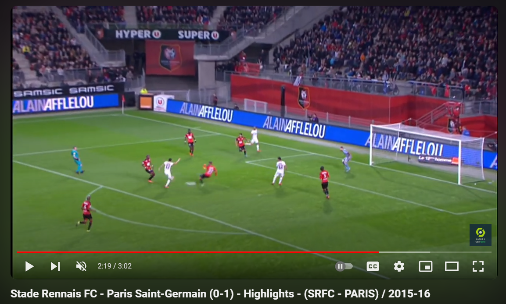
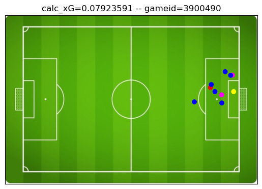
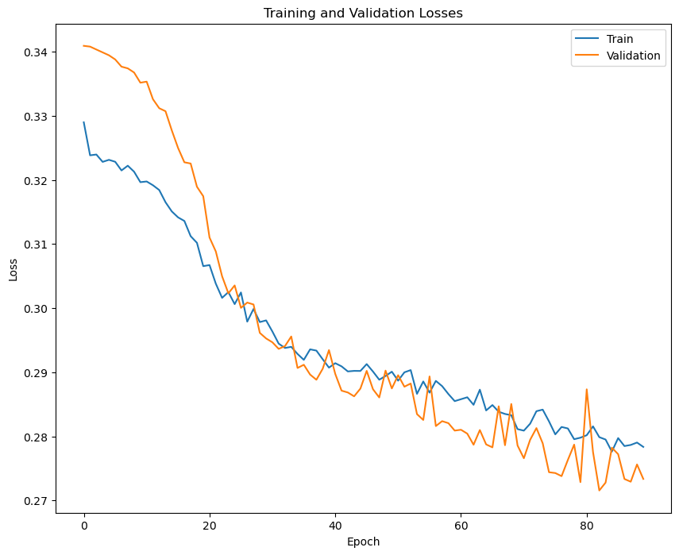
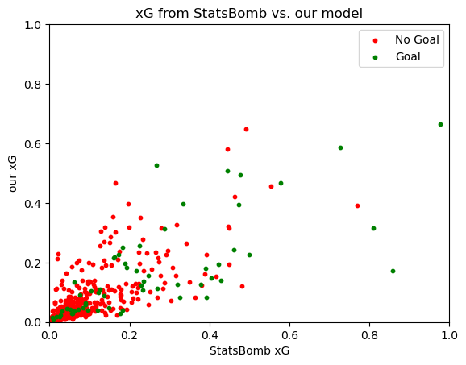
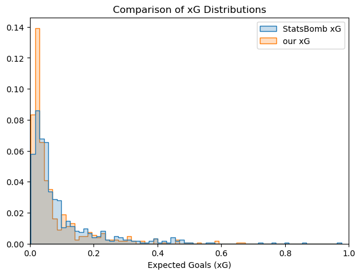
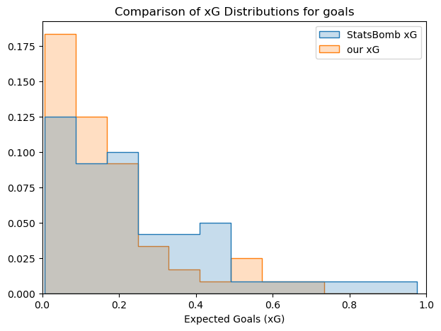

# xG project

#### TLDR
In this project, we aim to build a prototype for a deep learning model that is trained to estimate the expected goals (xG) for a given shot (and its surroundings) in a football match. We will attempt to show that our model's results are very interesting and compare its performance against the xG metric provided by StatsBomb, which is also the provider of the data employed.

### Intro

A common issue in football analysis (and many other sports) is coming up with a metric to evaluate how well one side is playing. A late trend in football is to use a sort of Bayesian statistic commonly labeled "expected STAT" or "xS" (expected goals, expected assists, etc.).

In this project, we focus on xG, but later we will comment on how a model to calculate xG can allow us to make a great variety of analyses and predictions.

The main idea behind xG is to grasp that ability that every football player, fan and analyst possesses about how dangerous a particular play was and make it a metric that intends to measure how good the shot that a team produced was. A good explanation of xG can be found in [this post](https://medium.com/@dberbatov/football-analytics-101-a-beginners-guide-to-the-expected-goals-xg-metric-4f416693d98c) and visualization can be seen [here](https://torvaney.github.io/projects/xG.html). From a statistical standpoint, one can define xG as the probability function that outputs the likelihood of a certain shot ending as a goal given all the circumstances that affect said shot. These circumstances can be more or less obvious, such as the position of the shooter, the position of the defenders, the position of the keeper, and the kind of shot (header, left foot, right foot), but they can also have many other variables, such as the speed or the height of the ball prior to impact—was it a cross? Was it curved? Was the shooter dribbling before impact, the position of the teammates, the altitude of the location where the game is being played, the condition of the pitch, etc.

Under the broad definition presented, a mathematical approximation for xG is extremely complex; there are way too many variables to account for, and a statistical model would be too complex to make sense. Therefore, a good idea would be to limit drastically the scope of the problem. The current calculations of xG limit the scope of the general problem to a much more limited problem. As mentioned in the blog shown before, one of the current approaches is to reduce the problem to calculating the probability distribution function of a goal given the position of the shooter. Other stat companies define it slightly differently, by adding a penalization for players in front of the shooter, for instance, but the main idea remains the same.

In this project, I attempt to use the ability of Neural Networks as a universal approximator of functions to approximate the probability function of a goal using the information present in the events dataset from the [StatsBomb open data dataset](https://github.com/statsbomb/open-data). This data includes information regarding the positions of all the players around the ball, their teams, positions, roles (such as goalkeeper, forward, etc.), origin of the play (corner, throw in, normal play, etc.), previous pass (own dribble, pass, cross, etc.). StatsBomb also provides us with its own calculation, xG (from now on, SBxG), that will allow us to compare the outputs of our model with their metric.

### Proof of concept

For this PoC we will employ a model based on architecture used in [this paper](https://github.com/jingraham/neurips19-graph-protein-design/), where graph theory is applied to model the geometrical and chemical information of proteins, employing an architecture that falls into the category of Graph Convolutional Neural Networks. The referred model uses as features the positions of amino acids in the space, as well as the angles of its inner bonds, the kind of amino acid, etc. In this project we will adapt this model to work with the shot data, using the positions of the players, among other pieces of information, as the features. Instead of predicting the probabilities of the 20 amino acids in each position of the protein sequences, we will predict whether a goal is scored from the shot.

We will use the data from the Ligue 1, season 2015/16. For instance, the first goal that can be found in the dataset is from the game between PSG and Rennes, where Di María scored the only goal. The highlights of the game can be found [here](https://www.youtube.com/watch?v=uUOkoz_6f2Y).

A visualization of the positional information present in the database can be seen in the following figure.

On top, StatsBomb calculated xG and the game ID in the database can be seen. On red is the actor, meaning the player executing the shot; on blue is the opposition team; on purple are the actor's teammates; and on yellow is the opposition's goalkeeper. That's all the information we will use for now, although many other features could be employed to further improve the model.

Mathematically, we can define xG as: 

$$xG = P(Goal | S(t_i))$$

Where $S(t_i)$ is the state of the field at time $i$. Then, in order to model the state of the field, we use graph theory. 

Graphs are mathematical structures employed to model phenomena that present relations between objects. They consist of a set of Nodes (or vertices) and a set of Edges (or arcs or links). For a more detailed, but also accessible, definition of graph theory, see the [Wikipedia page](https://en.wikipedia.org/wiki/Graph_theory).

For our modeling of the state of the field, we take the players as the Nodes and the distances between them as the Edges.

It's important to note that depending on the Neural Network architecture on use, features from Nodes, from Edges, or from both can be employed. In this case, we use an architecture that allows features from both.

For Nodes, we use features such as normalized position in the field and type of agency (player making the shot, defenders, teammates, goalkeeper). For edges, we use Euclidean distance and angle between players. It's also important to note that there are many other pieces of information available in the dataset that can be processed to obtain features that could be used in this model.

### Training
We divided the Ligue 1 (2015/16) database into training, validation and test sets in a proportion of 0.8, 0.1 and 0.1. The training of the model is displayed in the following image:

Here we show the value of the loss function through the training of the model. We can see the values obtained in the training set as well as in the validation set, showcasing that, in fact, the model learns the distribution of goals, and what it learns is generalizable to the validation dataset.

We stop the training when we get the best loss function value for the validation dataset. We obtain a model that takes as input the position of the players in the camera when the shot is delivered and outputs the probability of a goal.

Furthermore, we evaluate our model using the test dataset, which has not influenced in any way the training of the model or the selection of its parameters and hyperparameters. A natural way to evaluate our model is to compare it to other calculations of xG. StatsBomb open data provides a calculation of xG (SBxG) for each shot, so we use it as a comparison.

We see that both metric align decently well, with many of the top chances according to SBxG being also scored highly in our xG.

We can also calculate the correlation between SBxG and our xG:

metric|All shots|Just goals|Just not goals
---|:---:|:---:|:---: 
Spearman corr|0.818|0.809|0.793
Pearson corr|0.768|0.733|0.743

We can see that our model's xG and the one provided by StatsBomb correlate pretty well, either in the entire dataset or in just the shots that ended up in goals.

### Comparisons between SBxG and ours

We could attempt to figure out how the metrics compare to each and which one fits better the data. We can initially see the differences in the probabilty distributions.

Looking at the distribution plots and at the scatter plot with all the shot, we can see that our model tends to have lower values of xG in general. An explanation for this could be that our model has awareness of more information, and therefore is more likely to find factors that diminish the value of the xG. This obviously depends on how SBxG is calculated, which is not public domain as far as we are aware.

Some metrics to measure how well an approximation of a probability function fits the actual data are presented:

**Brier score** is basically an MSE between the output of the function and the real values. It can range between positive infinite and zero, with zero being the ideal. **Area under the curve (AUC)** of a receiver operating characteristic curve (ROC) evaluates how well the output fits real data when several thresholds for classification are tested. Its values range between 0 and 1, being 1 the ideal.

metric|StatsBomb xG|our XG
---|:---:|:---:
Brier score|0.0727|0.0797
AUC|0.8033|0.7731

### Future work

There are two main points of future work:

- The prototype presented here is small and fairly simple in its implementation, and there are plenty of sources for improvement.
- As we mentioned before, this PoC has potential to generate many potential application in sport analytics.

#### Improvements

- The dataset used to train the model is fairly small (approximated 6000 shots). By aggregating more seasons and leagues, this dataset could be increased greatly.
- Combined with the size of the training dataset, the model used is also fairly small. A bigger dataset would allow to train a bigger dataset maintaining ability to generalize across data.
- As it was mentioned, there are few features that could be added to pipeline that should improve its performace. 

#### Potential applications

As we showed before, we define the state of the field in time $t$ with a graph $G_t$: 

$G_t = \left\{V_t, E_t\right\}$, where $V_t=\left\{V_j  \in  \Re^{f_v}\right\}$ and $E_t=\left\{E_{jk}  \in  \Re^{f_e}\right\}$

With $f_v$ being the size of the vertices features and $f_e$ the size of the edge features.
	 
We previously defined the expected goals $xG$ for a shot that occurs in time $t$. Then we attempt to train a model with an architecture $F$ and learned weights $W$ to approximate the $xG(t)$ function. 

$$xG(t) =p(Goal|S(t)) \simeq F(w, G_t)$$

Let's assume that we are somewhat successful in training this function (as we have shown previously) and also assume we have access to previous and following states of field in times $t-1$, $t-2$, $t+1$, etc. Let's also define a dangerous shot as any shot with a $xG>threshold$. We now could train the same model in a different task (with the same architecture $F$ and the same representation of State of field at time $t' = G_{t'}$, but different weights $W'$). This time we trained our model on, given a state of the field at time $t$, to predict whether a dangerous shot occurred in the following $k$ times, with $k$ equal to a range from $1$ to $K$.

$$p\Bigl(\sum_{k=1}^K (xG(t+k)>threshold) \big| G_t\Bigr) = F(W', G_t)$$

In practice, this allows us to score the tactical advantage of every state of the field, similarly to how chess analysis is performed. And, just like chess analysis, this allows us to identify changes in tactical advantage, giving us the possibility to evaluate tactics or players performances in offensive or defensive plays, providing interesting insights for coaches, analysts, and fans.

As an additional note, models can be also fine-tuned with some particular set of data (for instance, a different league, a different season, etc.). Providing a tool to predict the performances of players in other leagues or tournaments or to analyze potential tactical changes inspired by other teams.

Finally, this model as presented here is just a proof of concept, but it can be extended easily to other sports where the concept of a "state of the field" can be defined and modeled as a graph. For example, in basketball, the state of the field could be defined by the positions of the players, the ball possession, the time left in the game, etc. The potential applications of this type of model are vast and can provide valuable insights in many sports analytics domains.
